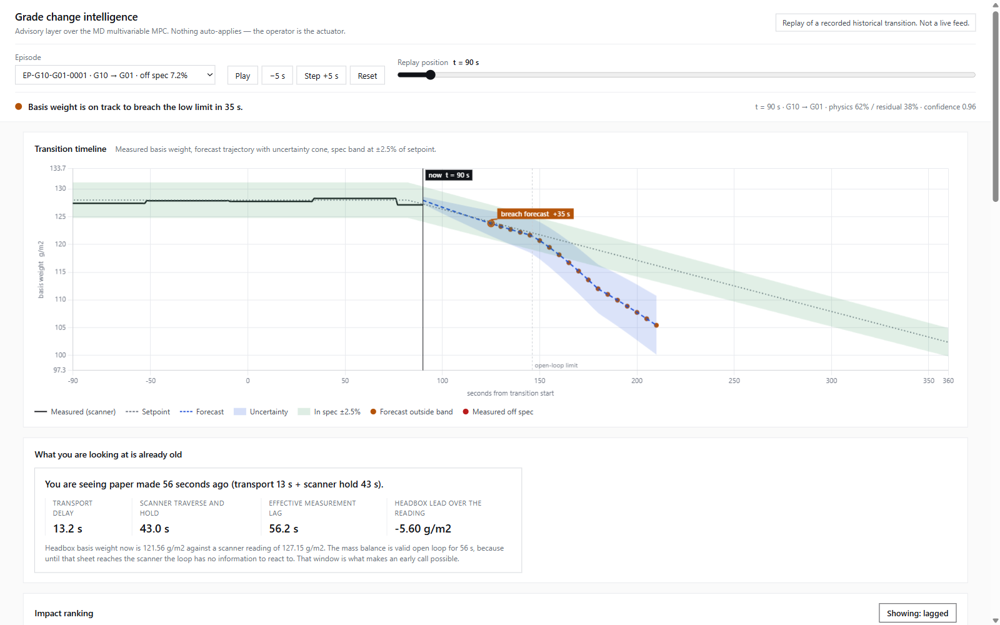
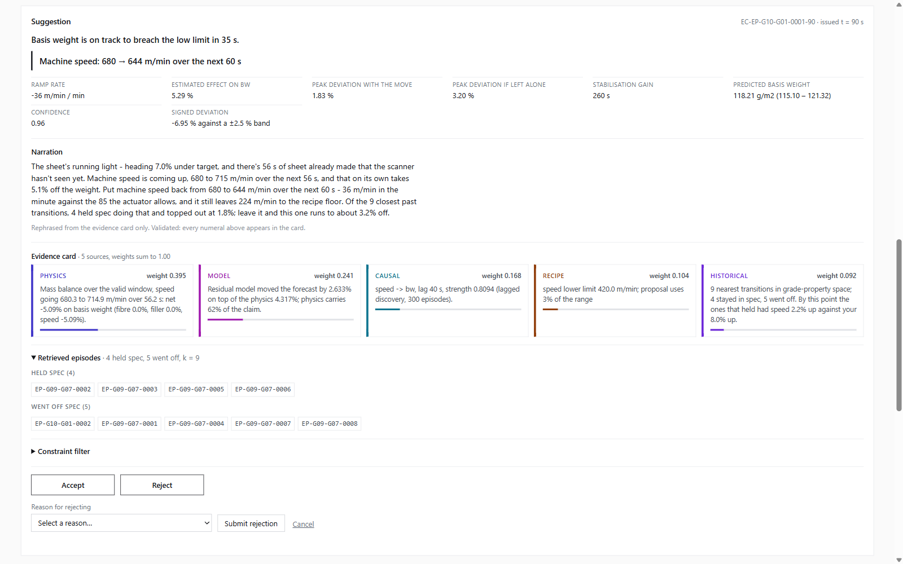
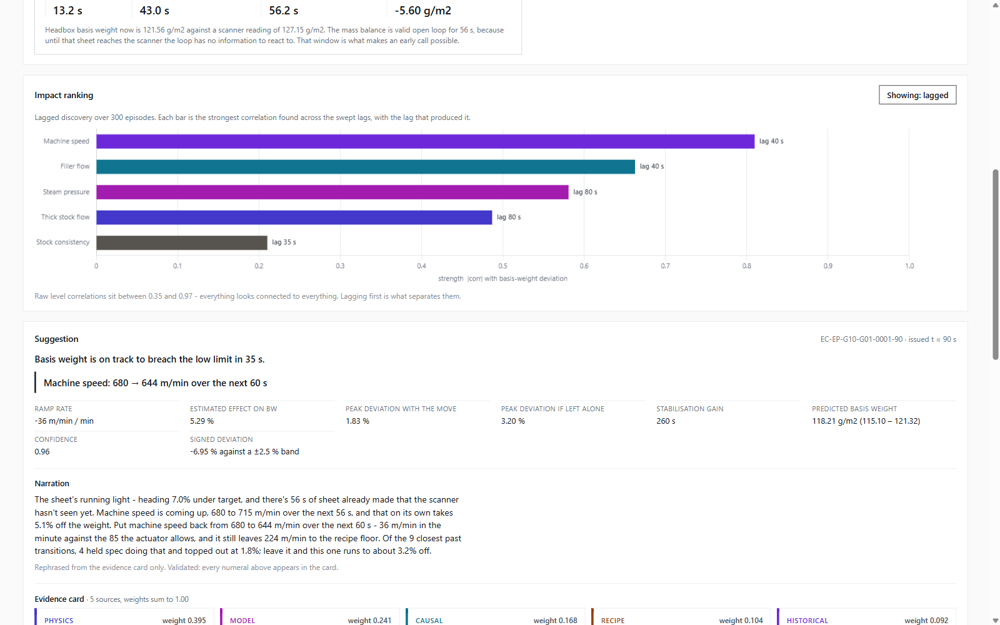
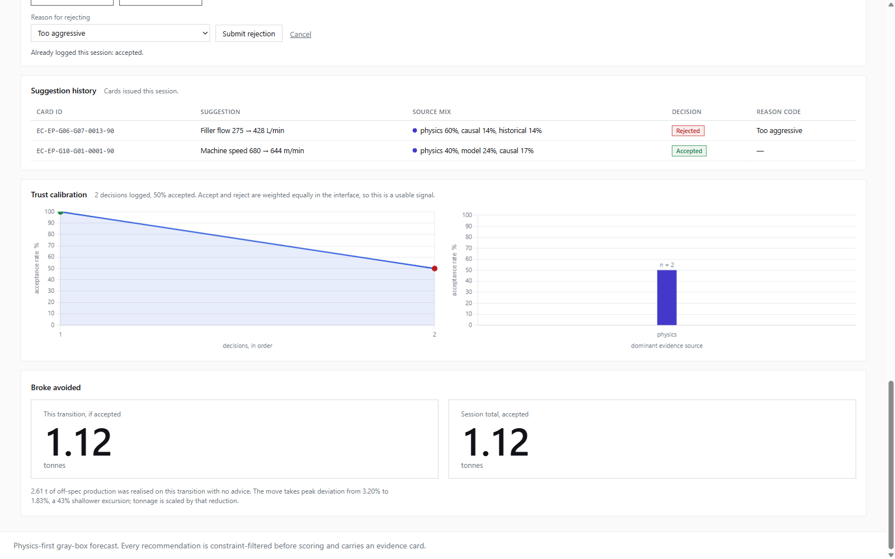
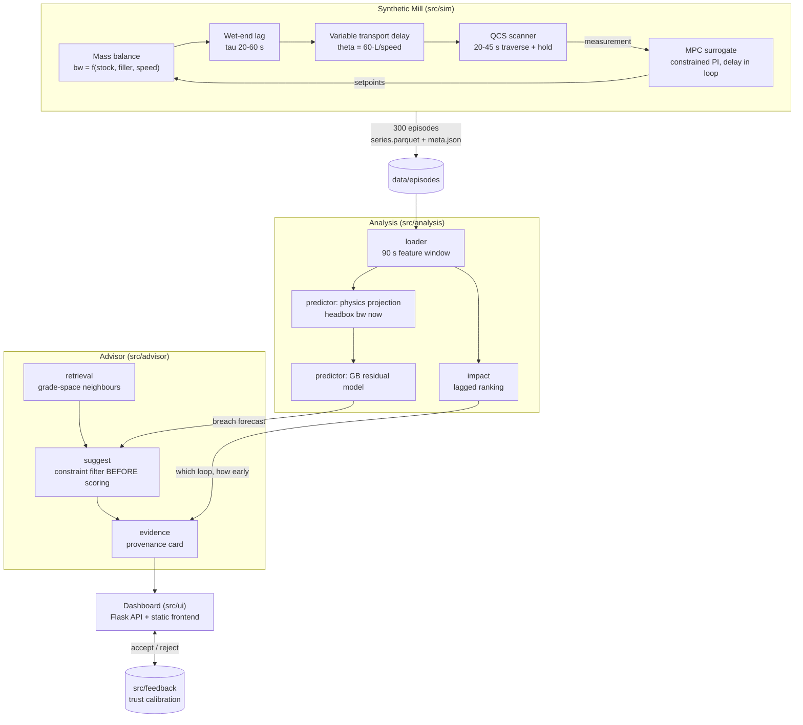

# Grade Change Intelligence

An advisory intelligence layer over a paper machine's MD Multivariable MPC. During a
grade change the mill ramps stock flow, filler flow, steam pressure and machine speed
from one recipe to another. If those ramps desynchronise, basis weight leaves its 2.5%
spec band and the sheet made in the meantime becomes broke. GCI predicts that breach
before the operator can see it, recommends a constrained setpoint move to avoid it, and
attaches a traceable evidence card to every number it shows. It does not replace the
controller and never writes a setpoint — it advises.

## Evaluated against the five criteria

Each row states a measured fact and links to where it is derived. Every number comes from
300 episodes at seed 42; predictions are made from the first 90 s of each transition and
scored on 60 held-out episodes containing 23 real breaches.

| Criterion | Proof point | Detail |
|---|---|---|
| **Prediction accuracy** | Catches deviations before they exceed limits in **18 of 23** real breaches; the naive current-deviation rule catches **3 of 23** (recall 0.783 vs 0.130) | [RESULTS.md](docs/RESULTS.md#breach-prediction-from-90-s-of-data) |
| **Process optimization** | Across **67 issued recommendations**, forecast peak deviation falls from a median **4.13% to 1.85%** and **67 of 67** are brought back inside the ±2.5% band | [RESULTS.md](docs/RESULTS.md#what-the-advisor-actually-does) |
| **Explainability** | **All 67 cards carry exactly 5 weighted sources summing to 1.000**; narration is machine-validated so every numeral it prints must appear in the card | [RESULTS.md](docs/RESULTS.md#explainability-is-enforced-not-promised) |
| **Usability** | Working Flask dashboard; every card offers Accept/Reject with a structured reason code feeding trust calibration and an avoided-broke figure in tonnes | [screenshots](#what-it-looks-like) |
| **Historical-data use** | Case-based retrieval returns **k = 9** past transitions split by outcome; lagged discovery over **300 episodes** recovered the correct variable ordering and timing without being told it | [RESULTS.md](docs/RESULTS.md#impact-ranking-with-discovered-lags) |

What each of these does *not* establish is written down in
[docs/LIMITATIONS.md](docs/LIMITATIONS.md) — synthetic data, a directional-only
stabilisation ranking, and a constraint filter proven by adversarial test rather than by
naturally binding limits.

## The headline result

**The naive baseline catches 3 of 23 real breaches. This system catches 18 of 23.**

| Model | Accuracy | Precision | **Recall** |
|---|---|---|---|
| Naive (current deviation > 1.5%) | 0.650 | 0.750 | **0.130** |
| Physics only | 0.700 | 0.778 | **0.304** |
| **Gray-box (physics + residual)** | 0.783 | 0.692 | **0.783** |

Judged from the first 90 seconds of each transition, on a 60-episode held-out test set.

The reason is not a better classifier. It is *where the physics is evaluated*. What the
operator's screen shows is sheet that was formed a median of **41.4 s ago** — 7.2 s of
transport delay plus a 33.5 s scanner traverse-and-hold. A rule watching the displayed
deviation is reacting to a sheet that no longer exists. GCI runs the mass balance on the
**current setpoints**, so it reads the sheet already at the headbox before the scanner
reports it. The breach is not extrapolated; it is already committed to the sheet.

Physics carries 67% of the answer and the learned residual 33%, which is the intended
split — see [docs/RESULTS.md](docs/RESULTS.md) for the full numbers, the two tuning
experiments that were tried and rejected, and
[docs/LIMITATIONS.md](docs/LIMITATIONS.md) for what this does not establish.

## What it looks like

The dashboard replays a recorded transition. Nothing auto-applies — the operator is the
actuator.



Episode `EP-G10-G01-0001` at t = 90 s. The call is *"basis weight is on track to breach
the low limit in 35 s"*, made while the measured trace is still comfortably inside the
band. Underneath, the panel that justifies it: **you are seeing paper made 56 seconds
ago** — 13.2 s transport plus 43.0 s scanner hold. Headbox basis weight is already
121.56 g/m² against a scanner reading of 127.15 g/m². The sheet is light; the screen has
not caught up yet. That gap is the entire opportunity.



The recommendation — machine speed 680 → 644 m/min over 60 s — with peak deviation
quoted both ways (1.83% if the move is taken, 3.20% if it is not) against the ±2.5%
band. The narration is rephrased from the evidence card only, and every numeral in it is
validated to appear in the card. Below it the card itself: five weighted sources
(physics 0.395, model 0.241, causal 0.168, recipe 0.104, historical 0.092), the nine
retrieved neighbour transitions split by outcome, and the constraint filter.



The impact ranking with discovered lags. Speed and filler flow act on the sheet at 40 s,
steam and thick stock at 80 s — recovered from measured data alone, never told. Toggling
to the [zero-lag view](docs/screenshots/04-impact-ranking-zero-lag.png) is the point of
the exercise: raw level correlations sit between 0.35 and 0.97, so everything looks
connected to everything and no ordering survives.



Accept/reject is captured per card with a reason code, feeding trust calibration and an
avoided-broke estimate in tonnes. The [full page](docs/screenshots/07-full-page.png)
shows all of it in one view.

## Architecture



The constraint filter runs **before** scoring, not after. A setpoint that violates recipe
limits or actuator rates is never a candidate, so an unsafe recommendation cannot exist
as a scored option — structural, not advisory.

## Quickstart

Python 3.11+. Every command below was run against this repo before being written down.

**1. Environment**

```bash
python -m venv .venv
.venv/Scripts/python.exe -m pip install -r requirements.txt
```

On macOS/Linux use `.venv/bin/python` in place of `.venv/Scripts/python.exe` throughout.

**2. Generate the dataset**

`data/episodes/` is gitignored — the repo ships no data, so generate it first. Takes a
few minutes and is deterministic: seed 42 always yields byte-identical episodes.

```bash
.venv/Scripts/python.exe -m src.sim.generate --n 300 --out data/episodes --seed 42
```

**3. Gate the data on physical plausibility**

```bash
.venv/Scripts/python.exe -m tests.physics_check data/episodes
```

Exits non-zero and names the offending rule and episodes if anything is unphysical. This
must pass before the data is used for anything.

**4. Run the tests** — 90 tests

```bash
.venv/Scripts/python.exe -m pytest -q
```

**5. Reproduce the results**

```bash
.venv/Scripts/python.exe -m src.analysis.impact
.venv/Scripts/python.exe -m src.analysis.predictor
```

The first writes `data/impact_ranking.json`; the second prints the three-way accuracy
table quoted above.

**6. Launch the dashboard**

```bash
.venv/Scripts/python.exe -m src.ui.server
```

Serves on <http://127.0.0.1:8000/> — loopback only, no authentication. Run steps 2 and 5
first; the dashboard reads the generated episodes and the impact ranking.

## Repo structure

| Path | Contents |
|---|---|
| `src/sim/` | Synthetic Mill — mass balance, speed-dependent transport delay, scanner model, MPC surrogate, five injected failure modes |
| `src/analysis/` | 90 s feature window, physics-first breach predictor with gray-box residual, lagged impact ranking |
| `src/advisor/` | Grade-space retrieval, constrained counterfactual search, evidence-card assembly |
| `src/feedback/` | Accept/reject capture and trust calibration (SQLite) |
| `src/ui/` | Flask API plus static frontend; economics model for broke tonnage |
| `tests/` | 90 tests beside the modules they cover, plus `physics_check.py`, the standalone plausibility gate |
| `data/` | Generated episodes, grade catalogue, impact ranking, feedback DB — mostly gitignored |
| `docs/` | Results, limitations, decision log |
| `.claude/` | Project skills and agent definitions used to build this |

`src/causal/`, `src/episodes/`, `src/evidence/`, `src/forecast/` and `src/twin/` are empty
package placeholders from the original module plan; their functionality was consolidated
into `src/analysis/` and `src/advisor/` during the build.

## What is generated versus committed

`data/episodes/`, `data/*.parquet`, `data/*.db` and `data/grades.json` are gitignored to
keep the repo small; all of them are regenerated by the quickstart above. Documentation
screenshots are committed, so the README renders on a fresh clone.

| Artefact | Regenerate with |
|---|---|
| `data/episodes/`, `data/grades.json` | `python -m src.sim.generate --n 300 --out data/episodes --seed 42` |
| `data/features_90s.parquet` | `python -m src.analysis.predictor` (built and cached on first run) |
| `data/impact_ranking.json` | `python -m src.analysis.impact` (this one *is* committed) |
| `data/feedback.db` | Created empty on first dashboard interaction |

## Documentation

- [docs/RESULTS.md](docs/RESULTS.md) — accuracy tables, impact ranking with discovered
  lags, lag decomposition, and the statistical caveats
- [docs/LIMITATIONS.md](docs/LIMITATIONS.md) — what this does and does not establish
- [docs/decisions.md](docs/decisions.md) — dated log of the structural decisions and why

## Design rules

Four rules were treated as non-negotiable throughout, and the code is structured so that
breaking them is difficult rather than merely discouraged:

1. **No recommendation may violate recipe limits or actuator constraints.** Filtering
   happens before scoring, so unsafe options are never ranked.
2. **Every prediction and recommendation carries an evidence card.** No bare numbers
   reach the UI.
3. **All physical quantities carry explicit units**, validated against canonical ranges
   at the boundary of the module that produced them.
4. **Every result is reported against a named baseline.** The naive and physics-only
   columns above exist so the gray-box number cannot be read in isolation.
