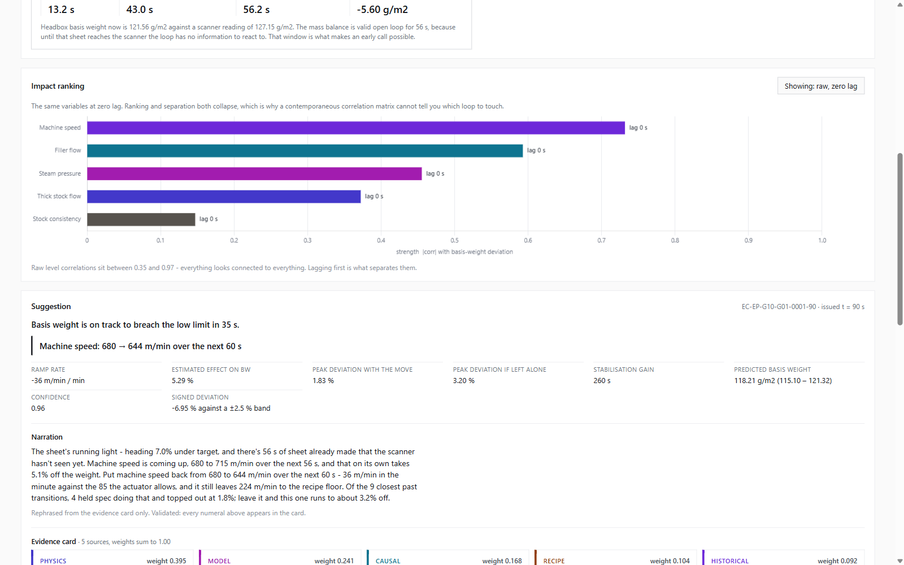

# Results

Every number here is produced by the commands in the README against 300 generated
episodes at seed 42. Reproduce with `python -m src.analysis.impact` and
`python -m src.analysis.predictor`.

Dataset: 300 episodes, 240 train / 60 test, stratified on `off_spec`. Test breach rate
0.383, so 23 of the 60 held-out episodes contain a real breach. All predictions are made
from the **first 90 seconds** of each transition. Decision thresholds are calibrated on
the training split only and applied blind to test — choosing them on test would be
leakage.

## Breach prediction from 90 s of data

| Model | Accuracy | Precision | Recall | TP | FP | FN | TN |
|---|---|---|---|---|---|---|---|
| Naive (current deviation > 1.5%) | 0.650 | 0.750 | 0.130 | 3 | 1 | 20 | 36 |
| Physics only | 0.700 | 0.778 | 0.304 | 7 | 2 | 16 | 35 |
| **Gray-box (physics + residual)** | 0.783 | 0.692 | 0.783 | 18 | 8 | 5 | 29 |

Thresholds calibrated on train: gray-box 2.45%, physics-only 2.75%.

Max-deviation MAE: physics-only 1.163%, gray-box 0.910%.

### Why recall is the metric that matters

The two error types are not symmetric in cost. A false negative is a missed breach: the
sheet goes off-spec, and every second of off-spec production at ~1000 m/min on a 6.4 m
trim is broke that must be repulped. A false positive is an advisory the operator reads
and dismisses — it costs a few seconds of attention. Optimising accuracy on a dataset
where 62% of episodes are clean rewards a model for staying quiet, which is precisely the
failure mode that makes an advisory system worthless in a control room.

That trade is visible in the table. The naive rule has *better precision* than the
gray-box model (0.750 vs 0.667) and is nearly useless, because it finds 3 of 23 breaches.
The gray-box model gives up precision to find 18 of 23. Nine false positives across 60
episodes is roughly one spurious advisory per seven transitions, which is an acceptable
price for catching six times as many real failures.

Precision was not allowed to fall freely, though. A threshold recalibration targeting
recall directly was tested and **rejected**: it reached 0.945 mean recall but drove test
precision to 0.503, below the 0.6 floor, in 15 of 15 random splits. See "Tuning that was
tried and rejected" below.

### Why the physics-only column is the interesting one

Physics alone triples the naive recall (0.130 → 0.304) using no learned parameters at
all — just the mass balance evaluated on current setpoints instead of on the stale
measurement. The residual model then more than doubles it again (0.304 → 0.783) by
absorbing what 90 s of data cannot identify: the per-episode wet-end time constant,
moisture coupling into the QCS total-weight reading, and controller behaviour through the
settle.

The contribution split is **67.4% physics / 32.6% learned residual**, with physics mean
absolute deviation 1.966% against a mean correction of 0.999%. This is checked
programmatically on every run: if the learned term ever exceeds 40% of the answer, the
report prints `MODEL IS DOING TOO MUCH - check physics path` rather than quietly
reporting a good score. Residual mean absolute error is 1.097% with standard deviation
1.376%.

## What the advisor actually does

The forecast is only half the system; the other half is the constrained move it proposes.
Running the advisor across all 300 episodes through the dashboard's own code path issues
**67 recommendations** — it stays silent on the rest, which is the correct behaviour when
no breach is forecast.

| Quantity | Result |
|---|---|
| Forecast peak deviation if left alone | median **4.13%** (mean 4.08%) |
| Forecast peak deviation with the move | median **1.85%** (mean 1.76%) |
| Reduction | median **57.4%**, shallower in **67 of 67** |
| Forecast excursions returned inside the ±2.5% band | **67 of 67** |
| Model-estimated stabilisation gain | median **66 s**, positive in 58 of 65 |

Two caveats belong with these numbers rather than in a footnote. The stabilisation gain
is derived from the stabilisation model, which **reaches no significance at p < 0.05**
(see below) — it is directional only. And the peak-deviation figures are the model's own
counterfactual, not a measured outcome: they compare the forecast with the move against
the forecast without it, both from the same predictor.

Every move is constraint-filtered before scoring. Across those 67 cards, **268 candidates
were generated and 0 were discarded by the filter** — all of them passed the recipe-limit
and actuator-rate checks unaided. That is a limitation, not a strength, and it is recorded
as one in [LIMITATIONS.md](LIMITATIONS.md): the filter is proven by an adversarial test,
not by naturally binding data.

## Explainability is enforced, not promised

Two properties are checked on every card the system produces rather than asserted in a
design document:

- **Five weighted sources, summing to 1.000.** Across all 67 issued cards the observed
  source count is exactly 5 and the observed weight sum is exactly 1.0 — no card was
  produced with a missing source or an unnormalised mix. A representative split is
  physics 0.395, model 0.241, causal 0.168, recipe 0.104, historical 0.092.
- **Narration cannot introduce a number.** `validate_narration` extracts every numeral
  from the generated sentence and rejects it unless that numeral appears in the card.
  It is enforced in the card-assembly path in `src/advisor/evidence.py`, not left to the
  caller, and is covered by tests including a tampered-narration case.

The gray-box split is asserted the same way: physics carries **67.4%** of the answer and
the residual **32.6%**, and the report fails loudly with
`MODEL IS DOING TOO MUCH - check physics path` if the learned term ever exceeds 40%.

## Impact ranking with discovered lags

Spearman-style association between each manipulated variable and measured basis weight,
swept over lags 0–120 s in 5 s steps, averaged across 300 episodes. Target is measured
`bw`, scan-period smoothed and differenced.

| Rank | Variable | Discovered lag | Strength at best lag | Strength at zero lag | Gain from lag |
|---|---|---|---|---|---|
| 1 | `speed` | 40 s | 0.809 | 0.732 | +0.078 |
| 2 | `filler_flow` | 40 s | 0.662 | 0.593 | +0.070 |
| 3 | `steam_p` | 80 s | 0.581 | 0.455 | +0.125 |
| 4 | `stock_flow` | 80 s | 0.487 | 0.372 | +0.115 |
| 5 | `stock_cons` | 35 s | 0.210 | 0.147 | +0.063 |

**These lags recover the simulator's planted causal structure without being told it.**
The ranking code reads measured columns only; `injected_faults` and `bw_true` are
simulator ground truth and are never available to it. The structure it recovers:

- `speed` and `filler_flow` act on the sheet immediately, so their discovered lag of
  40 s is the composed measurement lag itself (median 41.4 s — see below). The sheet
  changed at once; the scanner took 41 s to say so.
- `stock_flow` acts through the wet-end mixing volume, so it carries the composed
  measurement lag *plus* the wet-end time constant. Discovered at 80 s against
  41.4 + ~40 = ~81 s expected.
- `steam_p` acts through the dryer section's slow thermal response, likewise at 80 s.

The separation between the 40 s group and the 80 s group is the physically meaningful
result: it tells an operator which loop acts first and how far ahead of the display each
one moves.

### Why a correlation heatmap cannot produce this

Raw level correlation against basis weight scores every loop between **0.351 and 0.967**.
Everything correlates with everything, because a grade change ramps all of them together
— the setpoint ramp is a common cause. A heatmap therefore ranks loops by how hard they
were ramped, not by how much they moved the sheet, and carries no timing information at
all. The lag sweep is what separates them, and the timing is the actionable part.

The dashboard shows both views on a toggle, which makes the difference concrete:

| Lagged discovery | Zero-lag correlation |
|---|---|
|  |  |

Left: five loops cleanly separated, each labelled with the lag that produced its peak.
Right: the same five loops with no lag applied — bars near-saturated and the ordering
uninformative. Only the left panel tells an operator which loop to reach for.

## Lag decomposition

The claim the whole system rests on is that the operator's display is stale. This
quantifies it:

| Component | Median | Notes |
|---|---|---|
| Transport delay (`theta_sec`) | 7.16 s | Headbox to scanner at machine speed |
| Scanner traverse and hold | 33.5 s | QCS is a traversing sensor, not a point measurement |
| **Composed measurement lag** | **41.44 s** | p10 30.51 s, p90 51.10 s |

Transport delay alone understates staleness by roughly **5×**. Any evidence card quoting
`theta_sec` on its own would materially mislead the operator, so the composed figure is
what the UI shows and `theta_sec` is never quoted alone.

## Stabilisation-time ranking — directional only, not significant

The same lagged-association machinery was pointed at stabilisation time (how long the
mill takes to settle after the setpoint ramp completes). **No feature reaches
significance at p < 0.05.** Reported honestly:

| Feature | Spearman rho | p-value | Significant at 0.05 |
|---|---|---|---|
| `dev_at_90s` | −0.166 | 0.112 | No |
| `steam_p` | 0.081 | 0.439 | No |
| `speed_stock_desync` | 0.070 | 0.507 | No |
| `speed` | 0.069 | 0.509 | No |
| `effective_measurement_lag` | 0.058 | 0.579 | No |
| `stock_flow` | −0.042 | 0.687 | No |
| `stock_cons` | 0.041 | 0.696 | No |
| `bw_step_size` | −0.031 | 0.771 | No |
| `filler_flow` | 0.029 | 0.780 | No |

Fitted on 93 episodes, not 300. Stabilisation time is degenerate across the full dataset:
80% of episodes are already in-band when the setpoint ramp completes, so the value piles
up at zero. Tightening the band does not rescue it — a 0.5% band leaves 195 of 300
episodes never settling at all. The ranking is therefore fit on the off-spec subset only,
where the quantity is genuinely a recovery time, and 93 episodes is not enough to
establish these effects.

The strongest signal, `dev_at_90s` at rho −0.166 and p = 0.112, is *directionally*
sensible: episodes further off target at 90 s take longer to recover. It should be read as
a hypothesis worth testing on more data, not as a finding.

## Tuning that was tried and rejected

Recorded because a negative result is still a result.

**Residual model hyperparameter sweep.** A 27-point grid over `n_estimators`
{100, 200, 400} × `max_depth` {2, 3, 4} × `learning_rate` {0.03, 0.05, 0.1}, on the same
80/20 split. Run before the alarm features below were added, so the comparison is against
the then-current feature set. The best cell (200 / 2 / 0.10) appeared to beat the shipped
configuration (200 / 3 / 0.05) on all three metrics: accuracy 0.817 vs 0.767, precision
0.731 vs 0.667, recall 0.826 vs 0.783.

Repeating both configurations across 15 different split seeds showed this was an artefact
of selecting on one test split. Averaged over 15 splits the "winner" is **worse**: mean
recall 0.765 vs 0.800, better on 2 splits, worse on 9, tied on 4. The shipped
configuration was kept unchanged.

**Recall-targeted threshold recalibration.** Replacing the accuracy-maximising cut point
with the lowest cut point whose *training* precision still cleared 0.6. Mean recall rose
from 0.800 to 0.945, but mean test precision fell to 0.503, and test precision landed
below the 0.6 floor in **15 of 15 splits** — the constraint held on train and did not
survive out of sample. Rejected.

Both were re-run against the current feature set before submission, and both failed
again. The sweep produced six cells beating the shipped recall on the seed-42 split
(0.826 vs 0.783), but across 15 splits the two strongest were **worse** than shipped:
mean recall 0.754 and 0.762 against 0.800, better on only 2 of 15 splits each. The
recall-targeted threshold reached mean recall 0.960 but mean precision 0.494, clearing
the 0.6 floor in **1 of 15 splits**. The shipped configuration
(200 / 3 / 0.05, accuracy-maximising threshold) was kept unchanged.

Both experiments were run out-of-tree; the residual model's hyperparameters and decision
rule are unchanged.

**Alarm history as a feature — kept, but it earns nothing here.** Five features were
added from the QCS alarm tags inside the 90 s window: overall alarm fraction, basis-weight
alarm fraction, other-quality (`MOIST_DEV`/`ASH_DEV`) fraction, whether `BW_DEV_HIGH` ever
fired, and the count of distinct tags. On the seed-42 split they appear to help — accuracy
0.767 → 0.783, precision 0.667 → 0.692, MAE 0.939% → 0.910%, recall unchanged.

Across 15 splits that gain evaporates: recall delta **+0.0001** (better on 3, worse on 3,
tied on 9), precision −0.006, accuracy −0.004. It is the same single-split artefact as the
hyperparameter sweep above.

The reason is structural rather than disappointing. In this simulator alarm tags are
*derived from* the very deviations the model already has —
[`src/sim/episode.py`](../src/sim/episode.py) sets `BW_DEV_WARN` by thresholding `bw_dev`
— so they carry no information the deviation features do not. On a real machine, alarm
history also contains equipment trips, scanner diagnostics and process alarms that no
basis-weight trace implies, and the redundancy would not hold. The features are kept
because the ingestion path is real and correct, not because they improved this result.

**Operator actions were deliberately *not* featurised.** Inside the 90 s decision window
`op_action` is `grade_change_start` on all 300 episodes — a zero-variance constant. The
genuine interventions (`manual_stock_bias_up`/`down`, 32 across the dataset) all occur
after the window and so are unavailable at decision time. Adding the column would have
produced the appearance of using operator history without any of the substance.
