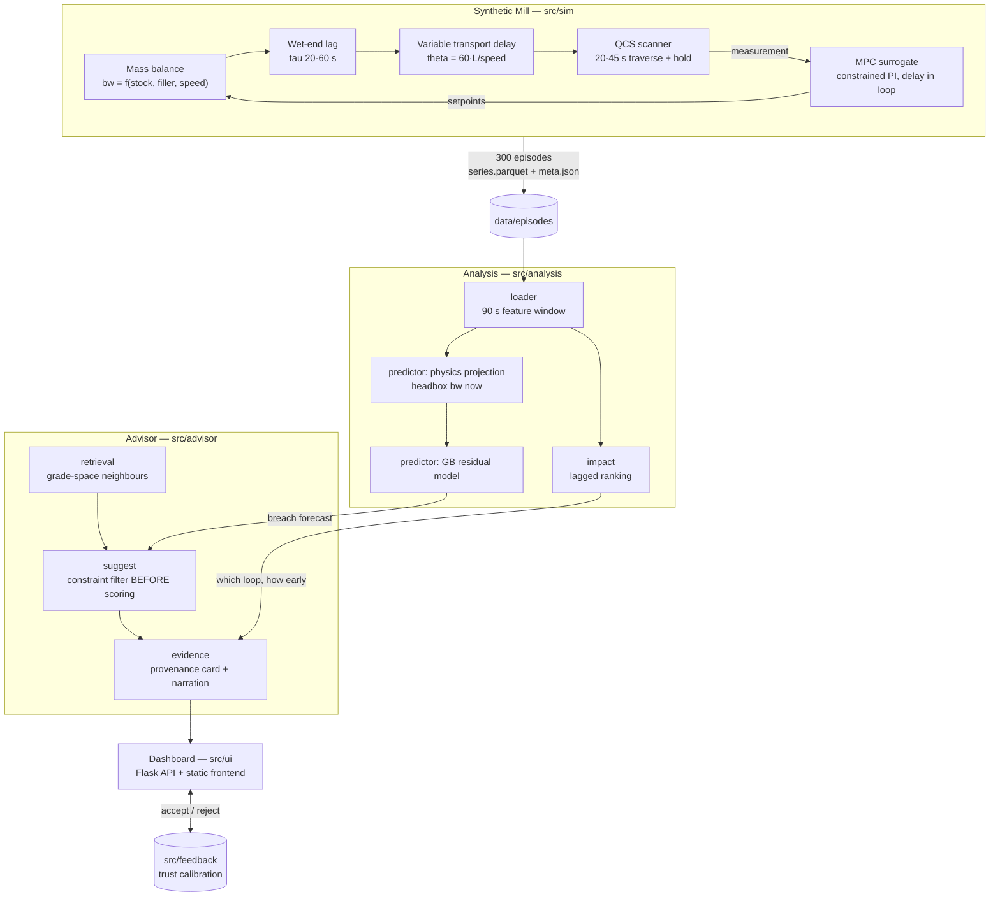

# Architecture

Grade Change Intelligence (GCI) is an **advisory** layer over a paper machine's MD
multivariable MPC. It does not replace the controller and never writes a setpoint. It
predicts a basis-weight excursion during a grade transition, proposes a constrained
setpoint move, and attaches traceable evidence to every number it shows.

## The idea in one paragraph

During a grade change the mill ramps thick stock flow, filler flow, steam pressure and
machine speed together. If those ramps desynchronise, basis weight leaves its ±2.5% spec
band and the sheet made in the meantime becomes broke. The difficulty is that the QCS
scanner reading an operator watches is **a median 41.4 s old** — 7.16 s of transport
delay from headbox to scanner, plus 33.5 s of scanner traverse and zero-order hold. A
rule that watches the displayed deviation is reacting to sheet that no longer exists.
GCI evaluates the mass balance on the **current setpoints** instead, which describes the
sheet already at the headbox but not yet measured. Inside that lag window the breach is
already committed to the sheet, so the call is arithmetic rather than a trend fit.

## Data flow

## Modules

| Path | Responsibility |
|---|---|
| `src/sim/` | Synthetic Mill. Mass balance, first-order wet-end lag, speed-dependent transport delay by cumulative-travel inversion, QCS scanner model, MPC surrogate with the delay inside the loop, five injected failure modes. |
| `src/analysis/` | 90 s feature window (`loader.py`), physics-first breach predictor with a gray-box residual (`predictor.py`), lagged impact ranking (`impact.py`). |
| `src/advisor/` | Grade-space case retrieval, constrained counterfactual search, evidence-card assembly and validated narration. |
| `src/feedback/` | Accept/reject capture with reason codes and trust calibration (SQLite). |
| `src/ui/` | Flask API plus static frontend; economics model for broke tonnage. |
| `tests/` | 90 tests beside the modules they cover, plus `physics_check.py`, a standalone six-rule physical plausibility gate. |

`src/causal/`, `src/episodes/`, `src/evidence/`, `src/forecast/` and `src/twin/` are empty
package placeholders from the original module plan; their functionality was consolidated
into `src/analysis/` and `src/advisor/` during the build.

## The three structural decisions

**1. Gray-box, physics first.** The mass balance is not fitted — it is the relation the
mill obeys. A gradient-boosted residual corrects only what 90 s of data cannot identify:
the per-episode wet-end time constant, moisture coupling into the QCS total-weight
reading, and controller behaviour through the settle. The split is asserted on every run
at **67.4% physics / 32.6% model**, and the report fails loudly with
`MODEL IS DOING TOO MUCH - check physics path` if the learned term exceeds 40%. This is
what makes the result explainable rather than merely accurate.

**2. The constraint filter runs before scoring.** A setpoint that violates recipe limits
or actuator rates is removed from the candidate set *before* anything is ranked, so an
unsafe recommendation cannot exist as a scored option. `ScoredCandidate.of` re-checks
admissibility and raises rather than accepting an inadmissible candidate. This is
structural, not advisory — see `src/advisor/suggest.py`.

**3. Every number carries an evidence card.** No bare figure reaches the UI. Each card
carries exactly five weighted sources summing to 1.000 (physics, model, causal, recipe,
historical). The LLM-style narration only rephrases the card: `validate_narration`
extracts every numeral from the generated sentence and rejects it unless that numeral
appears in the card, enforced in the card-assembly path rather than left to the caller.

## Why the timing matters

Lagged association over 300 episodes recovers the planted causal structure without being
told it:

| Variable | Discovered lag | Interpretation |
|---|---|---|
| `speed` | 40 s | Acts on the sheet at once; the lag *is* the measurement lag |
| `filler_flow` | 40 s | Same — immediate action, delayed measurement |
| `steam_p` | 80 s | Slow dryer thermal response on top of the measurement lag |
| `stock_flow` | 80 s | Measurement lag plus the wet-end mixing time constant |
| `stock_cons` | 35 s | Weakest channel |

The separation between the 40 s group and the 80 s group is the actionable result: it
tells an operator which loop acts first and how far ahead of the display each one moves.
A contemporaneous correlation matrix cannot produce it — raw level correlations score
every loop between 0.351 and 0.967 because the transition ramps them together, so the
ordering reflects how hard each was ramped rather than how much it moved the sheet, and
carries no timing at all.

## Interfaces and conventions

- All time series are pandas DataFrames indexed by `t_sec` (float, seconds from episode start).
- Episode IDs are `EP-{grade_from}-{grade_to}-{seq:04d}`.
- All physical quantities carry explicit units, validated against canonical ranges at the
  boundary of the module that produced them (`src/sim/units.py`).
- Random seeds are explicit arguments, never global. Seed 42 regenerates every episode
  byte-identically.
- No module imports from `src/ui/`; `src/ui/` imports from everything else.

## What this architecture does not do

It is advisory only. There is no path from GCI to the controller: it produces a
recommendation, an operator accepts or rejects it, and any actual move is made by a human
through the existing MPC. Nothing here has been designed or reviewed for closed-loop use.
See [LIMITATIONS.md](LIMITATIONS.md) for the full list, including the fact that the data
is synthetic and that the constraint filter has never had a naturally binding limit to
reject.
